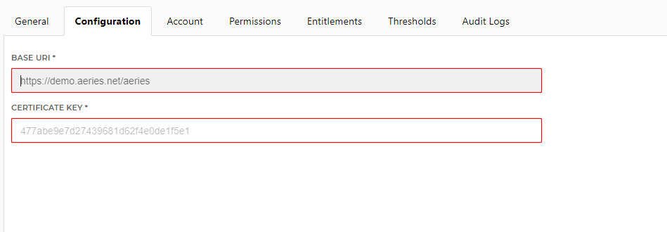

# HelloID-Conn-Prov-Target-Aeries-SIS-API

| :information_source: Information |
|:---------------------------|
| This repository contains the connector and configuration code only. The implementer is responsible to acquire the connection details such as username, password, certificate, etc. You might even need to sign a contract or agreement with the supplier before implementing this connector. Please contact the client's application manager to coordinate the connector requirements.       |

 

  

In this example we are going to write back to Aeries via the API, specifically for an email address field on Supplemental Data.

<!-- TABLE OF CONTENTS -->
## Table of Contents
* [Getting Started](#getting-started)
* [Setting up the API access](#setting-up-the-api-access)
* [Setup the PowerShell connector](#setup-the-powerShell-connector)

<!-- GETTING STARTED -->
## Getting Started
By using this connector you will have the ability to create one of the following items in Google GSuite:

* Create user account 
* Enable user account
* Disable user account
* Delete user account
* Manage permissions (grant / revoke)
  * Group Membership
  * Licenses (Statically defined)

## Setting up the API access
https://support.aeries.com/support/solutions/articles/14000077926-aeries-api-full-documentation

## Setup the PowerShell connector
1. Add a new 'Target System' to HelloID and make sure to import all the necessary files.

    - [ ] configuration.json
    - [ ] create.ps1
    - [ ] update.ps1

2. Fill in the required fields on the 'Configuration' tab. See also, [Setting up the API access](#setting-up-the-api-access)

* Base URI
* Certificate Key

_For more information about our HelloID PowerShell connectors, please refer to our general [Documentation](https://docs.helloid.com/hc/en-us/articles/360012558020-Configure-a-custom-PowerShell-target-system page_
 
# HelloID Docs
The official HelloID documentation can be found at: https://docs.helloid.com/
